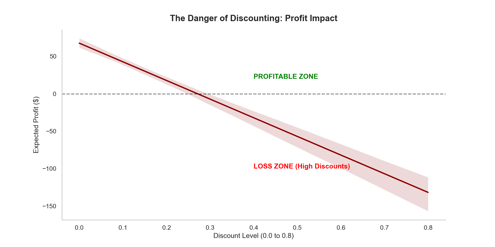
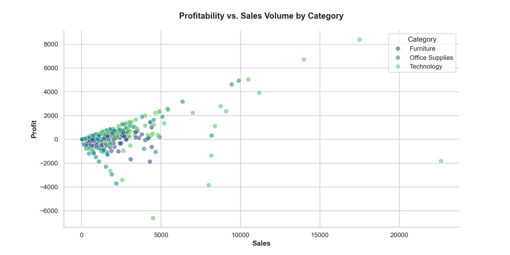
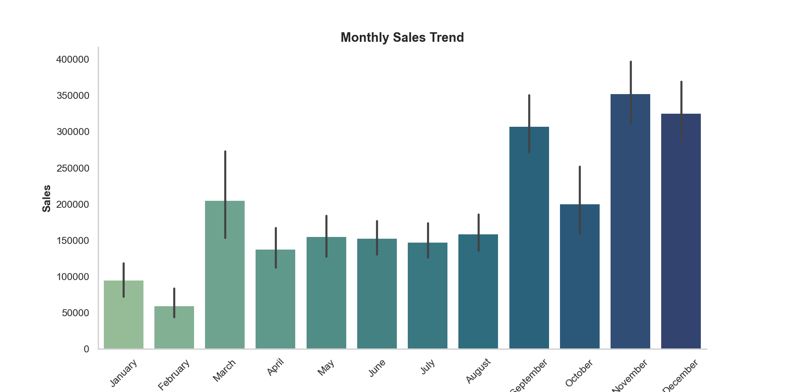
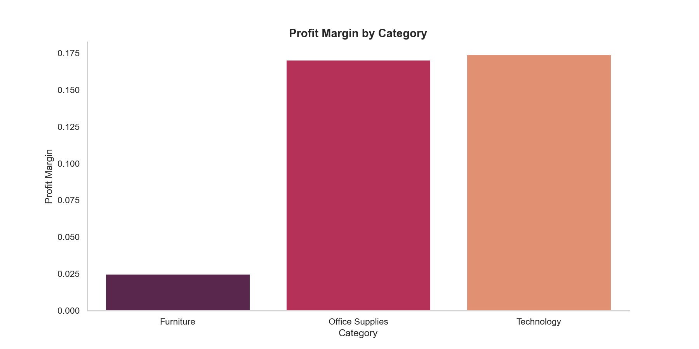
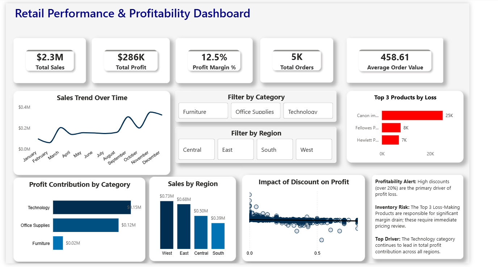

# 🛒 Retail Sales Analysis
End-to-end data analysis project to identify revenue drivers, optimize discount strategies, and improve business performance using Python, SQL, and Power BI
---

## 📌 Overview

Analyzed retail sales data to uncover insights on profitability, regional performance, and discount impact.

This project simulates a real-world analytics workflow—from data cleaning and exploration to building an interactive dashboard for business decision-making.

---

## 🚀 Project Highlights

- Built end-to-end sales analysis pipeline  
- Identified key profit loss drivers using discount analysis  
- Created interactive Power BI dashboard for decision-making  
- Combined Python, SQL, and visualization tools

---

## 🎯 Objective

- Identify top-performing categories and regions  
- Analyze the impact of discounts on profitability  
- Understand seasonal sales trends  
- Provide actionable business recommendations  

---

## 🛠 Tools Used

- Python (Pandas, Seaborn, Matplotlib)  
- SQL 
- Power BI  

---

## 📈 Key Business Questions

- What factors drive sales and profit?  
- How do discounts affect profitability?  
- Which categories and regions perform best?  
- Where are losses occurring?  

---

## 📊 Key Insights

- Technology is the highest revenue-generating category and should be prioritized for growth  
- West region drives 31% of total revenue ($725,000)
- November sales are 40% above monthly  
- California is the most profitable state with $76,000 profit  
- Consumer segment drives the highest sales but receives higher discounts, impacting margins
---
## 💼 Business Impact: 
- Prioritize Technology category for inventory, marketing, 
  and revenue growth — it outperforms all other categories
- Optimize discount strategies to improve margins
- Focus on underperforming regions for expansion opportunities

---

# 📊 Sample Visualization

### Discount vs Profit




### Profit VS Sales Volume By category




### Monthly Sales Trend



### Profit Margin By Category



---

📊 Dashboard

Below is the dashboard built using Power BI:



📁 You can explore the full interactive dashboard using the ".pbix" file in the "dashboard/" folder.


---

### 📁 Project Structure

```text
retail-sales-analysis/
│
├── data/
├── notebooks/
├── dashboard/
├── visualizations/
├── sql/
├── reports/
├── requirments.txt
└── README.md
```

---
# 🚀 How to Run

1. Clone the repository

2. Install dependencies:

```bash
pip install -r requirements.txt
```

3. Launch Jupyter Notebook:

```bash
jupyter notebook
```

4. Open and run the notebook from the `notebooks/` folder.
---

### 🎯 Conclusion

This project demonstrates end-to-end data analysis, from data cleaning and exploration to building an interactive dashboard for business decision-making.
